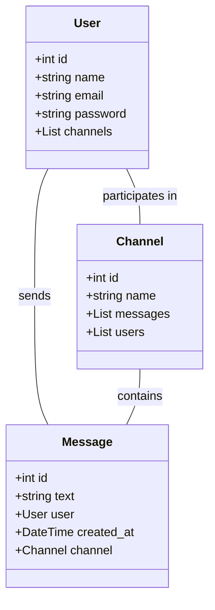
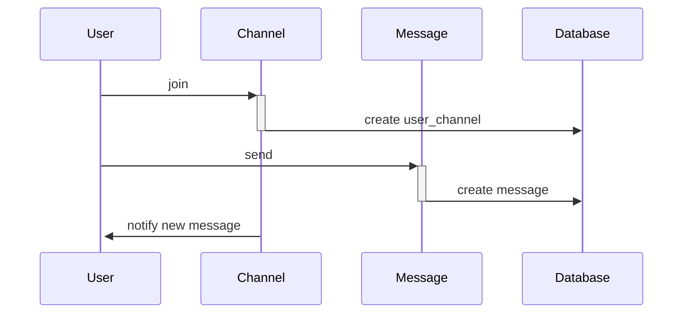
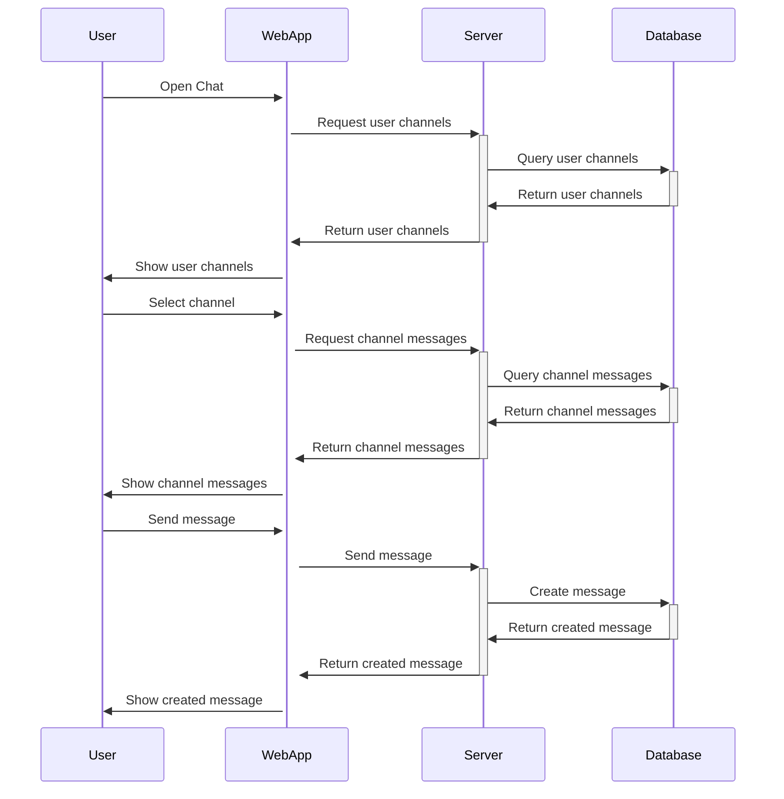
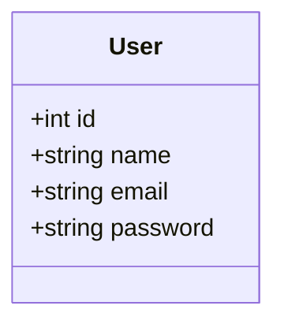
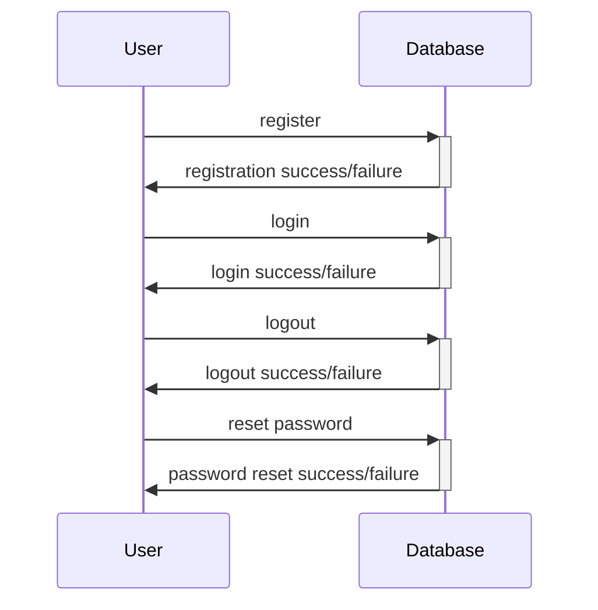

# 基本要件
- チャット機能：ユーザー同士がリアルタイムでメッセージをやりとりできる機能。
- チャンネル機能：ユーザーがトピック別に分けられたチャンネルを作成し、そこでチャットをする機能。
- 通知機能：新しいメッセージやリアクションがあった際に、ユーザーに通知する機能。
- ファイル共有機能：ユーザーがファイルをアップロードし、チャンネル内で共有できる機能。
- ユーザー管理機能：ユーザーの登録、ログイン、ログアウト、パスワードリセットなどの機能。
# 応用要件
- ボット機能：APIを利用して、チャットボットを導入する機能。
- スラック連携機能：Slackとの連携機能を提供することで、Slackのメッセージを取り込んで表示する機能。
- ビデオ/音声通話機能：ビデオ/音声通話を行える機能。
- カレンダー機能：スケジュール管理機能を提供することで、予定の調整ができる機能。
- タスク管理機能：タスクの追加、完了状況の確認ができる機能。

# チャット機能のドメインモデル図

# チャット機能のシーケンス図

# ユーザ管理機能のドメインモデル図

# ユーザ管理機能のシーケンス図

